# Отчет доступности сайтов, реализованных на платформе ГосВеб
## Ошибка “Приложение заставляет пользователя делать дополнительные действия при взаимодействии с поиском”

### Как воспроизвести ошибку

1.  Перейдите на сайт [https://sabakaevo.gosuslugi.ru](https://sabakaevo.gosuslugi.ru)
2.  В верхней части страницы нажмите на иконку “Лупа”

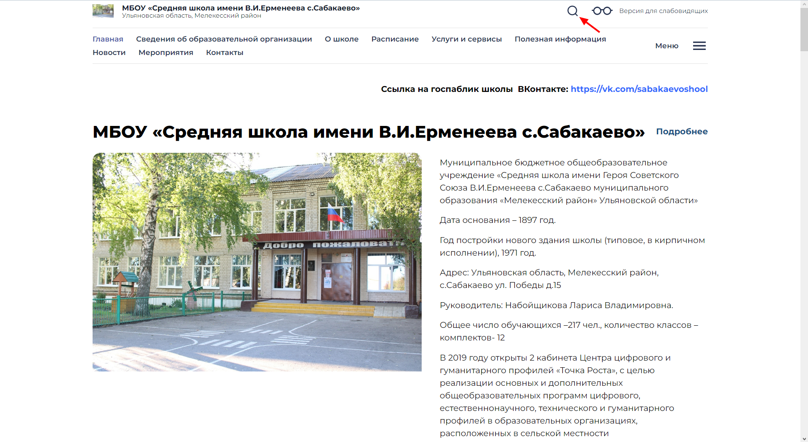

Откроется поле для ввода текста для поиска.

3.  Попробуйте сразу ввести какой-нибудь текст. У вас это не получится, потому что приложение не перенаправило вас в поле ввода текста. Поэтому вам нужно дополнительно нажать на поле. Тогда приложение позволит вам вводить текст. Для примера я ввел “текст для поиска”

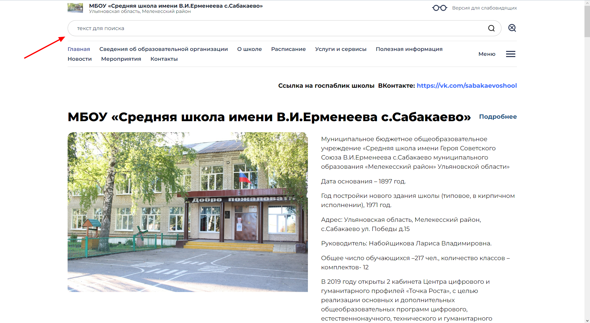

### Почему это важно исправить

Восприятие пользователя приложения напрямую зависит от того, насколько им просто пользоваться. Одним из важных критериев является количество взаимодействий для решения задачи. Чем их меньше, тем более проще пользователям. Поэтому приложение должно работать так, чтобы минимизировать количество их действий.

В нашем примере после открытия поля для поиска, приложение заставляет сделать дополнительное нажатие на поле для ввода текста. Это не обязательное действие. Я предлагаю, что после того, как пользователь нажал на иконку “Лупа”, приложение автоматически переносило пользователя на поле ввода текста, и таким образом он может вводить текст поиска без дополнительных нажатий.

## Ошибка “При изменении размера шрифта приложение не везде изменяет текст”

### Как воспроизвести ошибку

1.  Перейдите на сайт [https://sabakaevo.gosuslugi.ru](https://sabakaevo.gosuslugi.ru)
2.  Нажмите на иконку “Очки”

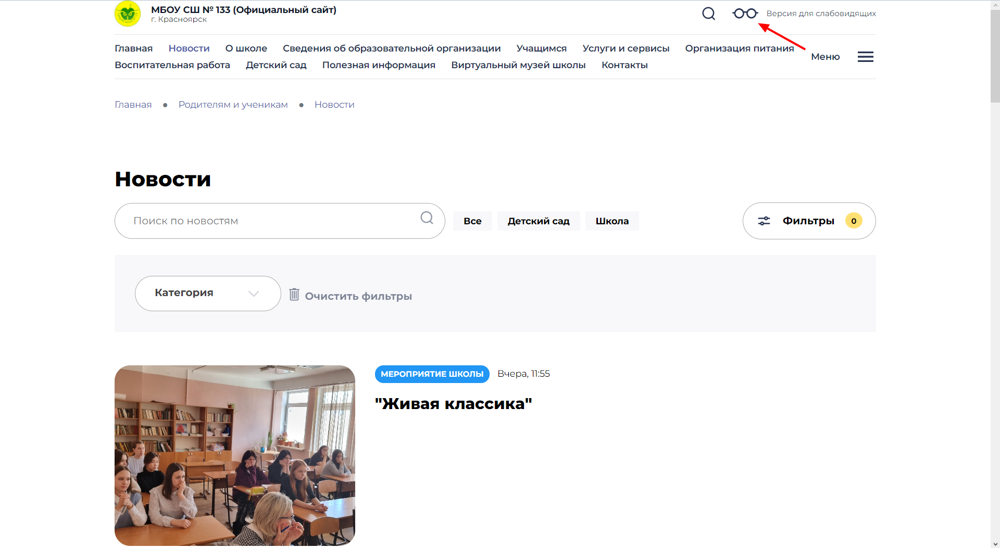

Откроется форма для настройки размера шрифта, цвета, межбуквенного интервала и межстрочного интервала.

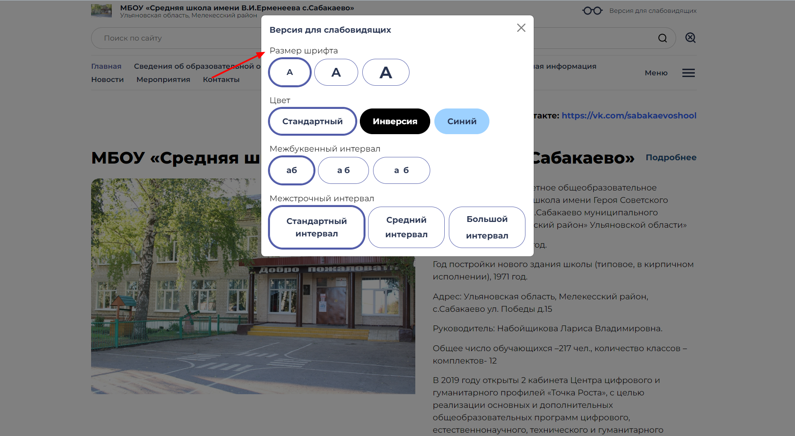

3.  Выберите самый большой размер шрифта. Текст на фоне станет больше, но в форме текст “Размер шрифта” и другой текст останется без изменений.

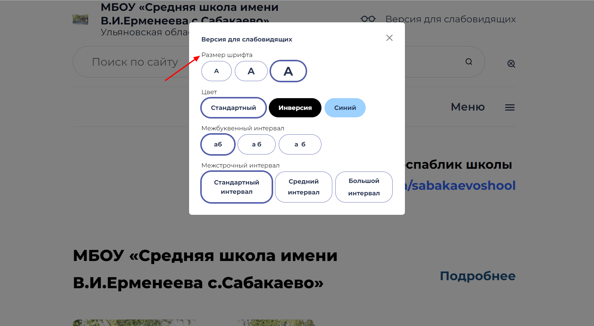

### Почему это важно исправить

Если пользователь захотел изменить размер текста, то он хочет, чтобы везде он стал таким, каким он хочет. Поэтому приложение должно это позволить.

## Ошибка “Пользователям со слабым зрениям приходится настраивать размер текста, читая текст маленького размера”

### Как воспроизвести ошибку

1.  Перейдите на сайт [https://sabakaevo.gosuslugi.ru](https://sabakaevo.gosuslugi.ru)
2.  Нажмите на иконку “Очки”

Откроется форма для настройки размера шрифта, цвета, межбуквенного интервала и межстрочного интервала.

### Почему это важно исправить

Если человек захотел использовать версию для слабовидящих, то это означает, что обычный текст ему сложно читать, т.е ему также сложно прочитать текст в форме настройки размера текста. Поэтому текст внутри формы нужно сразу сделать максимально крупным, а потом он уже сможет выбрать тот размер текста, который ему подойдет.

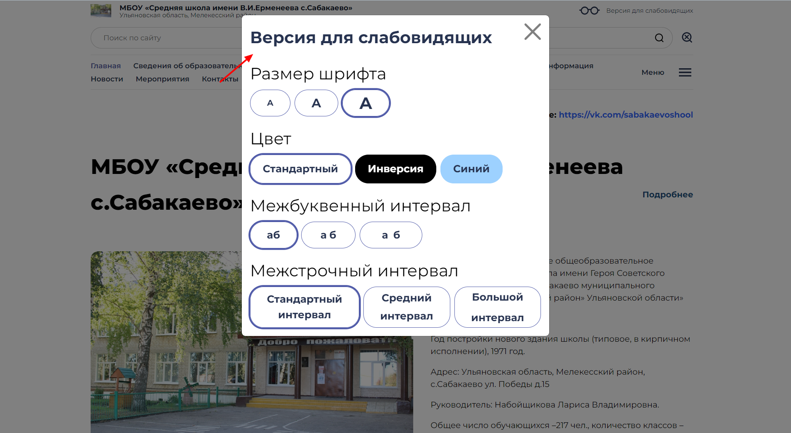

## Ошибка “Для пользователей клавиатуры нет выделения текущего пункта при переключении между пунктами с помощью клавиши вниз (↓) и вверх (↑)”
### Как воспроизвести ошибку

1.  Перейдите на сайт [https://sabakaevo.gosuslugi.ru/roditelyam-i-uchenikam/novosti/](https://sabakaevo.gosuslugi.ru/roditelyam-i-uchenikam/novosti/)
2.  Нажмите кнопку “Фильтры”

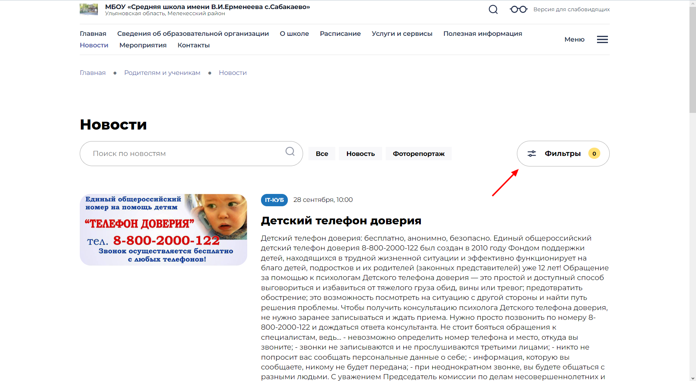

Откроется фильтр “Категория”

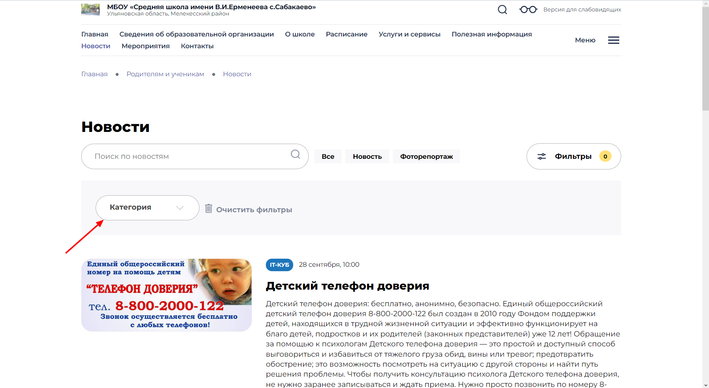

3.  Нажмите на него. Появится список.

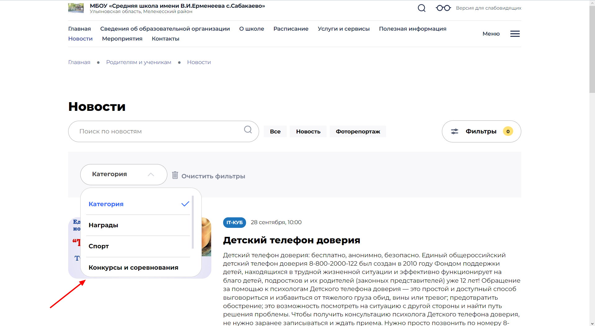

4.  Нажмите клавишу вниз (↓) на клавиатуре. Пункт “Категория” изменится на следующий пункт “Награды”.

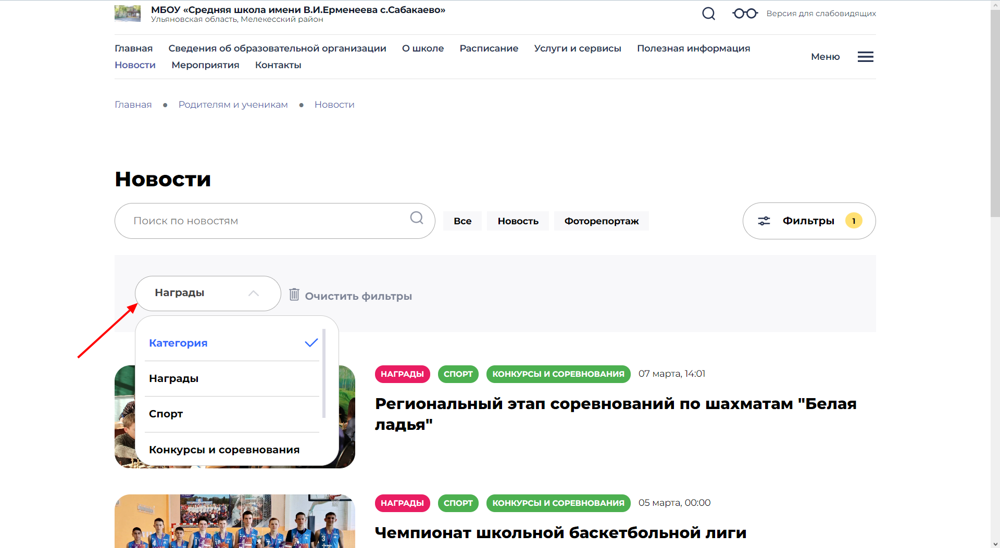

Но пункт “Награды”в списке никак визуально не выделен, поэтому пользователю не видно, на каком пункте он находится.  

### Почему это важно исправить

Пользователь может отвлечься по какой-то причине от взаимодействия с приложением. Для того, чтобы он быстрее вспомнил на каком пункте он находится, приложение должно отобразить это. Например, изменить цвет фона у пункта.

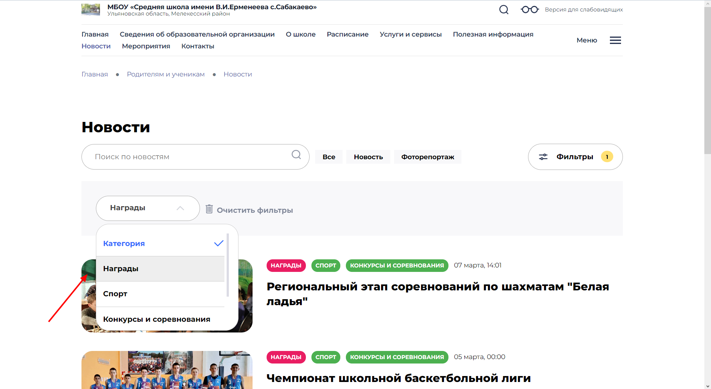

## Ошибка “Не все действия на сайте можно отменить с помощью клавиши Esc”
### Как воспроизвести ошибку

1.  Перейдите на сайт [https://sabakaevo.gosuslugi.ru](https://sabakaevo.gosuslugi.ru)
2.  Нажмите на иконку “Меню”

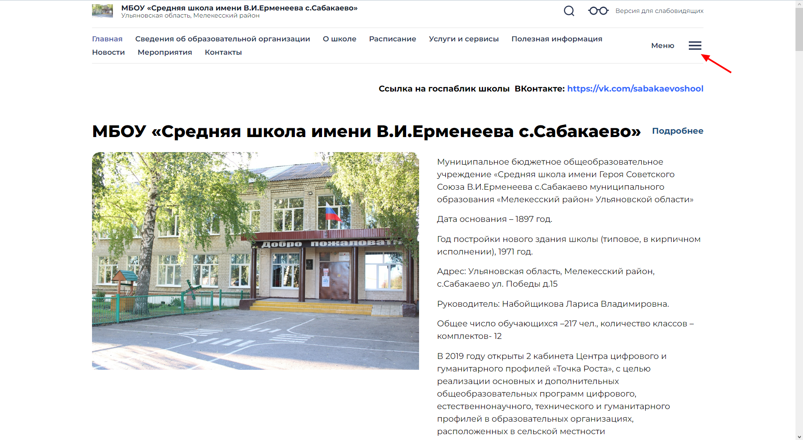

Откроется меню сайта.

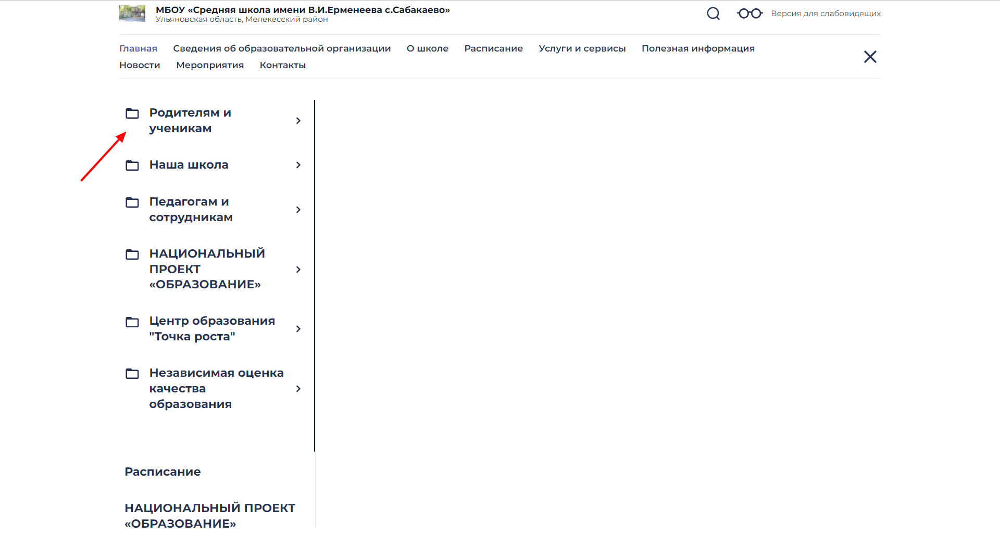

3.  Нажмите клавишу Esc на клавиатуре. Приложение проигнорирует вас. Чтобы закрыть меню есть только один способ, это нажать на иконку “Крестик.

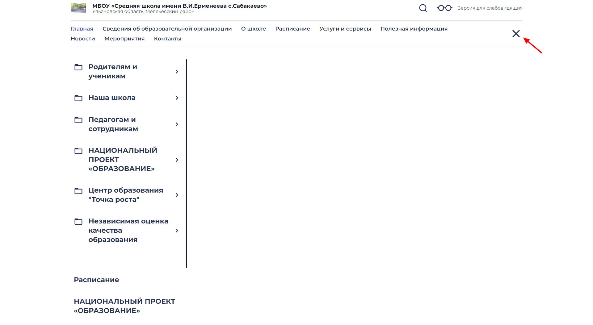

### Почему это важно исправить

Не все люди могут держать мышку в руках. Из-за этого они используют разного рода клавиатуры, с помощью которых могут взаимодействовать с интерфейсом. Базовым взаимодействием пользователя клавиатуры с приложением является отмена действия с помощью клавиши Esc.

В нашем примере с взаимодействием с меню, действие отмены это закрыть меню. Поэтому ее следует реализовать так, чтобы с помощью клавиши Esc пользователь мог закрыть меню.
